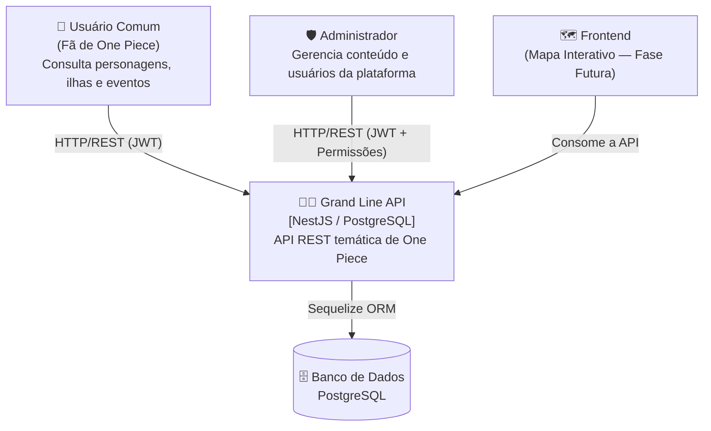
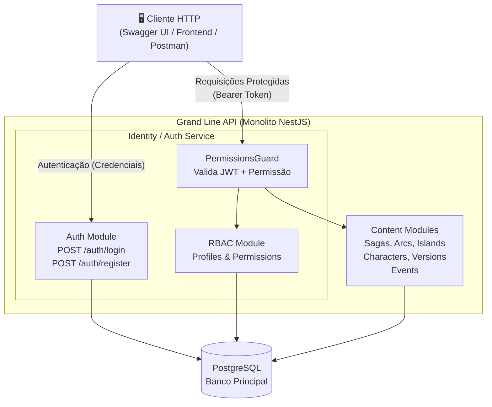

# 🏴‍☠️ Grand Line API

<p align="center">
  
  <br><br>
  <strong>A API canônica do universo One Piece</strong><br>
  <em>Enciclopédia de dados, cartografia interativa e controle de acesso granular</em>
</p>

---

## 🌊 O Projeto

A **Grand Line API** é o backend de um ecossistema temático de **One Piece**. O objetivo é construir uma plataforma onde o universo da obra seja modelado como dados estruturados: sagas, arcos, ilhas, personagens, eventos históricos e suas relações — tudo exposto via uma API REST documentada, segura e extensível.

O projeto foi construído como trabalho acadêmico (P1) e segue padrões de desenvolvimento profissional, incluindo arquitetura CQRS, controle de acesso baseado em permissões (RBAC) e documentação automática via Swagger.

---

## 🗺️ Fases do Projeto

| Fase | Descrição | Status |
|---|---|---|
| **Fase 1 - API & Segurança** | Criação de todos os endpoints CRUD, implementação de RBAC, autenticação JWT e documentação Swagger | ✅ Concluída |
| **Fase 2 - Regras de Negócio** | Implementação de 13 regras de domínio (bloqueios, cronologia, ilhas globais, status dinâmico) | ✅ Concluída |
| **Fase 3 - Dados & Narrativa** | Refatoração para Ilhas Globais, Eventos com Participantes e Status Inteligente | ✅ Concluída |
| **Fase 4 - Conteúdo (Seeds)** | Coleta e inserção de dados reais (Romance Dawn, Shells Town, Orange Town) | ✅ Concluída |
| **Fase 5 - Modelagem 3D** | Modelagem das ilhas icônicas (Alabasta, Marineford, etc.) em 3D para o mapa | 📋 Futura |

---

## 🏛️ C1 — Diagrama de Contexto

> *Quem usa o sistema e como ele se encaixa no mundo.*



### Atores Principais

| Ator | Descrição |
|---|---|
| **Usuário Comum** | Autenticado via JWT. Pode consultar sagas, arcos, ilhas, personagens e eventos. Não tem acesso a operações de escrita. |
| **Administrador** | Possui um Perfil com permissões amplas. Gerencia todo o conteúdo e os próprios usuários da plataforma. |

---

## 📦 C2 — Diagrama de Containers

> *Quais são as partes técnicas do sistema e como se comunicam.*



### Módulos Implementados

| Módulo | Prefixo | Responsabilidade |
|---|---|---|
| `auth` | `/auth` | Login e emissão de tokens JWT |
| `users` | `/users` | Gestão de contas de usuário |
| `profiles` | `/profiles` | Perfis de acesso e vínculo com permissões |
| `permissions` | `/permissions` | Catálogo de permissões do sistema |
| `sagas` | `/sagas` | Sagas cronológicas (ex: East Blue, Marineford) |
| `arcs` | `/arcs` | Arcos dentro das Sagas |
| `islands` | `/islands` | Ilhas com coordenadas para o mapa 3D |
| `events` | `/events` | Eventos históricos ocorridos nas ilhas |
| `characters` | `/characters` | Personagens (identidade fixa) |
| `character-versions` | `/character-versions` | Versões evolutivas por arco (recompensas, status) |
| `island-character-versions` | `/island-character-versions` | Vínculo entre personagens e as ilhas que visitaram |

---

## 🛠️ Stack Tecnológica

| Camada | Tecnologia |
|---|---|
| Framework | NestJS v11 |
| Linguagem | TypeScript |
| ORM | Sequelize + sequelize-typescript |
| Banco de Dados | PostgreSQL |
| Arquitetura | CQRS (Command Query Responsibility Segregation) |
| Autenticação | JWT (Passport.js) |
| Documentação | Swagger / OpenAPI |
| Infraestrutura | Docker Compose |

---

## 🚀 Como Rodar o Projeto

### Pré-requisitos
- Docker & Docker Compose instalados
- Node.js v20+

### 1. Clonar e configurar o ambiente

```bash
git clone https://github.com/arthurair3s/web-project.git
cd web-project
cp .env.example .env
```

Edite o `.env` conforme necessário. Para desenvolvimento local, os valores padrão do `.env.example` já funcionam com o Docker.

> **Dica para testes:** Defina `IGNORE_PERMISSIONS=true` no `.env` para desativar a checagem de permissões e testar os endpoints livremente.

### 2. Subir o banco de dados

```bash
docker compose up -d
```

### 3. Instalar dependências

```bash
npm install
```

### 4. Executar Migrations e Seeds (ou Reset Completo)

Para uma instalação limpa ou para limpar o banco após testes:
```bash
# Executa rollback total, migrações e seeds em um único comando
./reset.sh
```

Ou manualmente:
```bash
npx sequelize-cli db:migrate
npx sequelize-cli db:seed:all
```

### 5. Rodar a aplicação

```bash
npm run start:dev
```

A API estará disponível em: **`http://localhost:3000/api`**

A documentação Swagger estará em: **`http://localhost:3000/api/docs`**

---

## 🧪 Como Testar (Postman)

Deixamos uma coleção técnica completa na raiz do projeto:
`GrandLineAPI_Final_Collection.json`

1. Importe o arquivo no Postman.
2. Execute o request **0. AUTH > Login** (o token será salvo automaticamente).
3. Utilize os requests de **Bulk** para povoar o banco com dados massivos rapidamente.

---

## 🔐 Autenticação

Todos os endpoints (exceto `POST /auth/login`) exigem um token JWT no header:

```
Authorization: Bearer <seu_token>
```

Para obter um token, faça login com um usuário cadastrado:

```bash
POST /auth/login
{
  "email": "admin@admin.com",
  "password": "sua_senha"
}
```

---

## 📄 Licença

Desenvolvido para fins acadêmicos e de demonstração técnica. Inspirado na obra de Eiichiro Oda.
